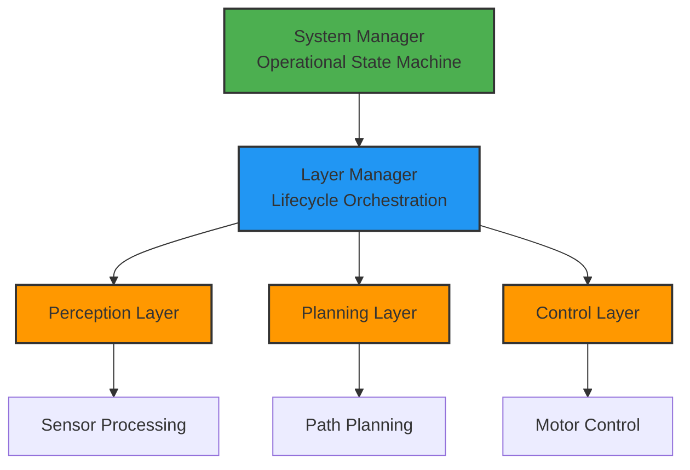

<div align="center">

# 🐻 Grizzly Rover 2025-26

**ROS 2 Autonomous Rover Software Stack**

[](https://docs.ros.org/en/humble/)
[](https://www.python.org/downloads/)
[](https://opensource.org/licenses/MIT)
[]()

**[📚 Documentation](https://washu-robotics-rover.github.io/grizzly-25-26/)** • 
**[🚀 Quick Start](#-quick-start)** • 
**[🏗️ Architecture](#-architecture)** • 
**[🤝 Contributing](docs/DEVELOPMENT.md)**

---

</div>

## 📖 Overview

A modular, lifecycle-managed ROS 2 software stack for the **WashU Robotics Rover Team**'s autonomous rover platform. Built with cross-platform support and designed for scalable, production-ready robotics development.

### ✨ Key Features

| Feature | Description |
|---------|-------------|
| 🎯 **Unified CLI** | Single `grizzly.py` command for install, build, run, and test |
| 🌐 **Cross-Platform** | Native support for macOS (robostack), Linux, and Windows |
| 🔄 **Lifecycle Management** | ROS 2 Lifecycle nodes with deterministic state transitions |
| 📦 **Modular Design** | Layer-based architecture for organized node management |
| 🧪 **Testing Suite** | Automated tests with coverage reporting (21+ tests) |
| ⚙️ **Custom Interfaces** | Purpose-built ROS 2 message definitions |

> **📘 Full Documentation**: For comprehensive guides, architecture details, and API references, visit our **[documentation website](https://washu-robotics-rover.github.io/grizzly-25-26/)**.

---

## 🚀 Quick Start

### Installation

```bash
# Clone the repository
git clone https://github.com/WashU-Robotics-Rover/grizzly-25-26.git
cd grizzly-25-26

# Install latest release (recommended)
./grizzly.py install

# Or build from source
./grizzly.py build
```

### Basic Commands

```bash
./grizzly.py run        # Launch the rover system
./grizzly.py test       # Run test suite
./grizzly.py --help     # Show all commands
```

<details>
<summary><b>📋 Prerequisites</b></summary>

### macOS
- Anaconda/Miniconda with ROS 2 Humble (via robostack)
- Python 3.11+

```bash
conda create -n ros_env python=3.11
conda activate ros_env
conda install -c robostack ros-humble-desktop colcon-common-extensions
```

### Linux (Ubuntu 22.04)
- ROS 2 Humble (native install)
- Python 3.10+

```bash
# Follow: https://docs.ros.org/en/humble/Installation/Ubuntu-Install-Debians.html
sudo apt update && sudo apt install ros-humble-desktop python3-colcon-common-extensions
```

</details>

<details>
<summary><b>🛠️ CLI Command Reference</b></summary>

### Build Commands
```bash
./grizzly.py build                              # Standard build
./grizzly.py build --clean                      # Clean build
./grizzly.py build --release                    # Release mode
./grizzly.py build --symlink-install            # Symlink for fast iteration
./grizzly.py build --packages-select <pkg>      # Build specific package
```

### Test Commands
```bash
./grizzly.py test                    # Run all tests
./grizzly.py test -v                 # Verbose output
./grizzly.py test --coverage         # Generate coverage
./grizzly.py test --html             # HTML coverage report
./grizzly.py test --list             # List available tests
./grizzly.py test --specific <name>  # Run specific test
```

### Run Commands
```bash
./grizzly.py run         # Launch system
./grizzly.py run --debug # Debug mode with verbose output
```

</details>

---

## 🏗️ Architecture



### Core Components

| Component | Description | Documentation |
|-----------|-------------|---------------|
| **System Manager** | Manages rover operational states (STARTUP → AUTONOMOUS → ...) | [State Machine Guide](docs/STATE_MACHINE_GUIDE.md) |
| **Layer Manager** | Orchestrates lifecycle of grouped nodes (perception, planning, control) | [State Management Guide](docs/STATE_MANAGEMENT_GUIDE.md) |
| **Custom Interfaces** | ROS 2 messages: `OperationalState`, `PerceptionState`, `NodeStatus` | [ROS Reference](docs/ROS_REFERENCE.md) |

### Repository Structure

```
grizzly-25-26/
├── grizzly.py                      # 🎯 Unified CLI entry point
├── grizzly_interfaces/             # Custom ROS 2 message definitions
│   ├── msg/                        # Message types
│   └── srv/                        # Service types
├── grizzly_stack/                  # Main software stack
│   ├── config/                     # YAML configuration
│   │   ├── core.yaml              # System parameters
│   │   └── layers.yaml            # Node layer definitions
│   ├── launch/                     # ROS 2 launch files
│   ├── src/grizzly_stack/core/    # Core system nodes
│   │   ├── system_manager.py      # State machine
│   │   ├── layer_manager.py       # Lifecycle orchestration
│   │   └── lifecycle_manager.py   # Startup management
│   └── test/                       # Test suite
└── docs/                           # Documentation (Docsify site)
```

> **🔗 Learn More**: Full architecture documentation at **[Architecture Guide](https://washu-robotics-rover.github.io/grizzly-25-26/#/ARCHITECTURE)**

---

## 📚 Documentation

Our comprehensive documentation is hosted at **[washu-robotics-rover.github.io/grizzly-25-26](https://washu-robotics-rover.github.io/grizzly-25-26/)**.

### Quick Links

| Topic | Link |
|-------|------|
| 🏗️ **System Architecture** | [ARCHITECTURE.md](https://washu-robotics-rover.github.io/grizzly-25-26/#/ARCHITECTURE) |
| 🔄 **State Machine Reference** | [STATE_MACHINE_GUIDE.md](https://washu-robotics-rover.github.io/grizzly-25-26/#/STATE_MACHINE_GUIDE) |
| 🎛️ **State Management** | [STATE_MANAGEMENT_GUIDE.md](https://washu-robotics-rover.github.io/grizzly-25-26/#/STATE_MANAGEMENT_GUIDE) |
| 🧪 **Testing Guide** | [TESTING.md](https://washu-robotics-rover.github.io/grizzly-25-26/#/TESTING) |
| 👨‍💻 **Development Guide** | [DEVELOPMENT.md](https://washu-robotics-rover.github.io/grizzly-25-26/#/DEVELOPMENT) |
| 📡 **ROS 2 API Reference** | [ROS_REFERENCE.md](https://washu-robotics-rover.github.io/grizzly-25-26/#/ROS_REFERENCE) |

<details>
<summary><b>💡 Usage Examples</b></summary>

### Monitor System State
```bash
ros2 topic echo /system/state
```

### Change Operational State
```bash
# Switch to autonomous mode
ros2 service call /system/change_state grizzly_interfaces/srv/ChangeState \
  "{requested_state: 2, reason: 'Starting autonomous mission'}"

# Emergency stop
ros2 service call /system/change_state grizzly_interfaces/srv/ChangeState \
  "{requested_state: 4, reason: 'EMERGENCY STOP'}"
```

### Lifecycle Management
```bash
ros2 lifecycle get /system_manager
ros2 lifecycle set /system_manager configure
ros2 lifecycle set /system_manager activate
```

> **📖 More Examples**: See [ROS Reference](https://washu-robotics-rover.github.io/grizzly-25-26/#/ROS_REFERENCE) for complete API usage.

</details>

---

## 🚧 Development Status

| Component | Status |
|-----------|--------|
| ✅ CLI Tool & Build System | **Implemented** |
| ✅ System Manager & State Machine | **Implemented** |
| ✅ Layer-Based Lifecycle Management | **Implemented** |
| ✅ Custom ROS 2 Interfaces | **Implemented** |
| ✅ Testing Infrastructure (21+ tests) | **Implemented** |
| 🚧 Perception Subsystem | **Planned** |
| 🚧 Planning Subsystem | **Planned** |
| 🚧 Control Subsystem | **Planned** |

---

## 🤝 Contributing

This is an internal project for the **WashU Robotics Rover Team**.

### Workflow

1. **Branch**: `git checkout -b feature/your-feature`
2. **Test**: `./grizzly.py test`
3. **Push**: `git push origin feature/your-feature`
4. **PR**: Create a Pull Request on GitHub

> **👨‍💻 Developer Guide**: See [DEVELOPMENT.md](https://washu-robotics-rover.github.io/grizzly-25-26/#/DEVELOPMENT) for coding standards and guidelines.

---

## 📞 Contact

- **Team**: WashU Robotics Rover Team  
- **Email**: huindam@gmail.com  
- **GitHub**: [@WashU-Robotics-Rover](https://github.com/WashU-Robotics-Rover)

---

<div align="center">

**Go Bears! 🐻**

*Built with ❤️ by the WashU Robotics Rover Team*

</div>
